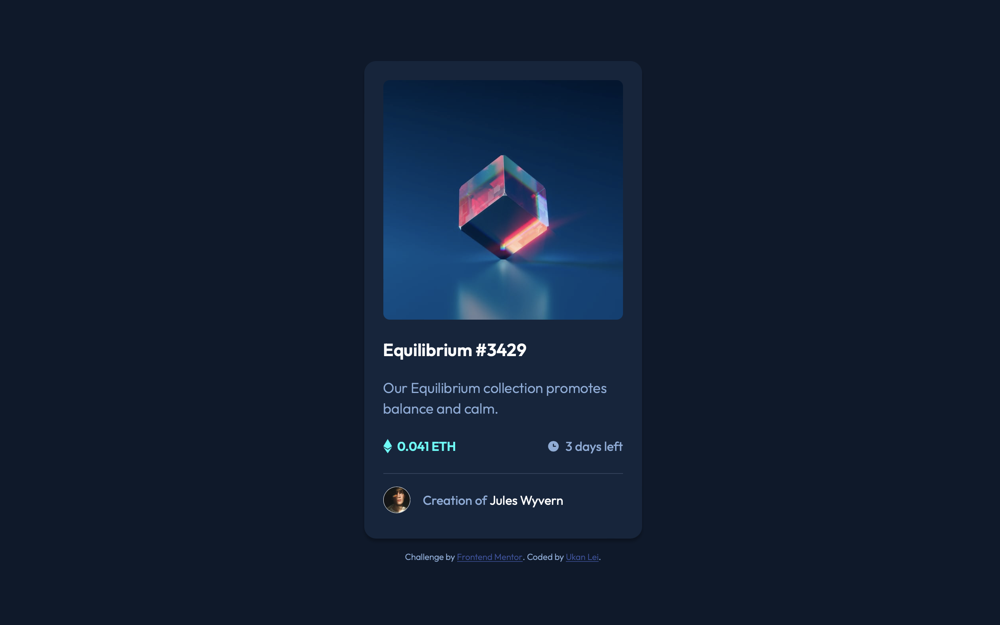

# Frontend Mentor - NFT preview card component solution

## Table of contents

- [Overview](#overview)
  - [The challenge](#the-challenge)
  - [Screenshot](#screenshot)
  - [Links](#links)
- [My process](#my-process)
  - [Built with](#built-with)
  - [Useful resources](#useful-resources)
- [Author](#author)

## Overview

This is a solution to the [NFT preview card component challenge on Frontend Mentor](https://www.frontendmentor.io/challenges/nft-preview-card-component-SbdUL_w0U).

### The challenge

Users should be able to:

- View the optimal layout depending on their device's screen size
- See hover states for interactive elements

### Screenshot

### Links

- Solution URL: [Github](https://github.com/ukanlei/frontendMentor/tree/master/nft-preview-card-component-main)
- Live Site URL: [Netlify](https://rococo-cactus-07f4be.netlify.app)

## My process

### Built with

- HTML
- CSS
- Flexbox
- Mobile-first workflow

### Useful resources

- [Centering things in CSS with flexbox](https://www.digitalocean.com/community/tutorials/css-centering-using-flexbox).

## Author

- [Linkedin](https://www.linkedin.com/in/ukanlei/)
- Frontend Mentor - [@ukanlei](https://www.frontendmentor.io/profile/ukanlei)
