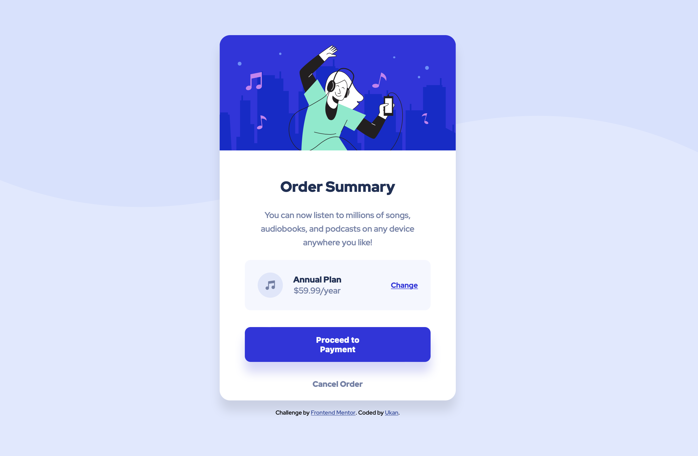

# Frontend Mentor - Order summary card

## Table of contents

- [Overview](#overview)
  - [The challenge](#the-challenge)
  - [Screenshot](#screenshot)
  - [Links](#links)
- [My process](#my-process)
  - [Built with](#built-with)
  - [Useful resources](#useful-resources)

## Overview

### The challenge

Users should be able to:

- See hover states for interactive elements

### Screenshot

### Links

- Solution URL: [Netlify](https://monumental-taffy-311137.netlify.app)
- Live Site URL: [Github](https://github.com/ukanlei/frontendMentor/blob/master/order-summary-component-main/README.md)

## My process

### Built with

- Semantic HTML5 markup
- SCSS/ SASS
- Flexbox
- Mobile-first workflow

### Useful resources

- [SASS basic](https://sass-lang.com/guide) - All the basics you need to get started with sass.
- [7-1 Patter](https://gist.github.com/rveitch/84cea9650092119527bc) - Ways to organize your scss.
