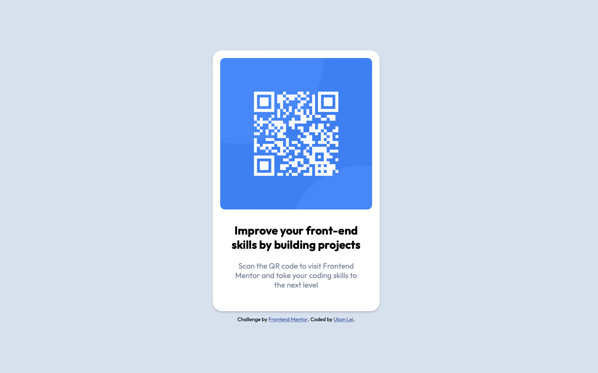

# Frontend Mentor - QR code component solution

## Table of contents

- [Overview](#overview)
  - [Screenshot](#screenshot)
  - [Links](#links)
- [My process](#my-process)
  - [Built with](#built-with)
  - [Issues & Solutions](#issues--solutions)
  - [Useful resources](#useful-resources)
- [Author](#author)

## Overview

This is a solution to the [QR code component challenge on Frontend Mentor](https://www.frontendmentor.io/challenges/qr-code-component-iux_sIO_H). In this solution:

- Users can view the optimal layout depending on their device's screen size.

### Screenshot



### Links

- Solution URL: [Github](https://github.com/ukanlei/frontendMentor/tree/master/qr-code-component-main)
- Live Site URL: [Netlify](https://cocky-mestorf-38a51c.netlify.app)

## My Process

### Built with

- HTML5
- CSS3
- Flexbox
- Mobile-first workflow

### Issues & Solutions

To fix problem with flex item overflowing past the top edge and getting cut off with no accessible way to scroll up to see the rest of the content, I removed `align-item:center` and `justify-content:center` from `body`:

```css
body {
  align-items: center;
  justify-content: center;
}
```

and replaced it with `margin:auto` instead. The `auto` margins will assume the leftover space, centering item where there's leftover space, and switching to normal alignment when there's not.

```css
.container {
  margin: auto;
}
```

^ [Reference](https://stackoverflow.com/questions/33454533/cant-scroll-to-top-of-flex-item-that-is-overflowing-container)

### Useful resources

- [Semi-transparent box shadow](https://css-tricks.com/almanac/properties/b/box-shadow/) - Found this article helpful in visualizing possible options and create some cool effect with the box-shawdow property
- [Scroll limitation with overflowing flex](https://stackoverflow.com/questions/33454533/cant-scroll-to-top-of-flex-item-that-is-overflowing-container) - Super helpful in helping me figure out the issues I was having when using flex to center items.

## Author

- [Linkedin](https://www.linkedin.com/in/ukanlei/)
- Frontend Mentor - [@ukanlei](https://www.frontendmentor.io/profile/ukanlei)
